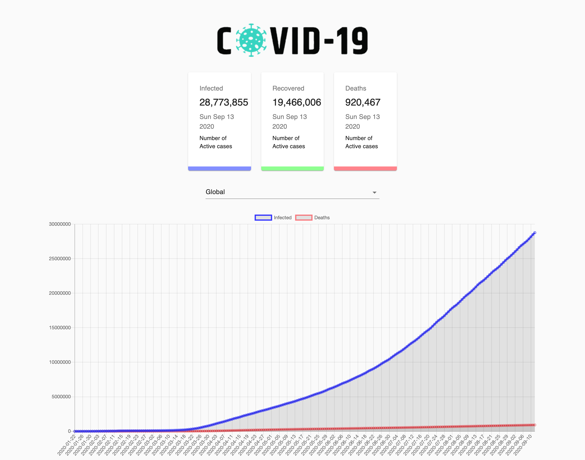

# COVID-19 Tracker - by Mihir Suchak

- Project: _Covid-19 tracker._
- Language/Frameworks: _Typescript(with React) + CSS_

## Howdy! 👋

Hey there, this is Mihir Suchak.



### [Live Site](https://covid-19-tracker-seven.vercel.app/)

##### Introduction:

- This is basic COVID-19 Track app for.
- I have used this [API](https://covid19.mathdro.id/api).
- I have used TypeScript as well.
- In this app I have used CSS Modules so class names are scoped locally by default.

### Src Structure / Components

```
src
├── index.tsx
├── App.tsx
├── api
|   ├── index.ts
├── Components
|   └── Cards
|       ├── Cards.module.css
|       ├── Cards.tsx
|   └── Chart
|       ├── Chart.tsx
|       ├── chart.modules.css
|   └── CountryPicker
|       ├── CountryPicker.tsx
|       ├── CountryPicker.modules.css
|   ├── index.ts
├── images
|   ├── covid-19.png
public
├── index.html
```

##### Setup:

`run npm i && npm start` to start the development server.
